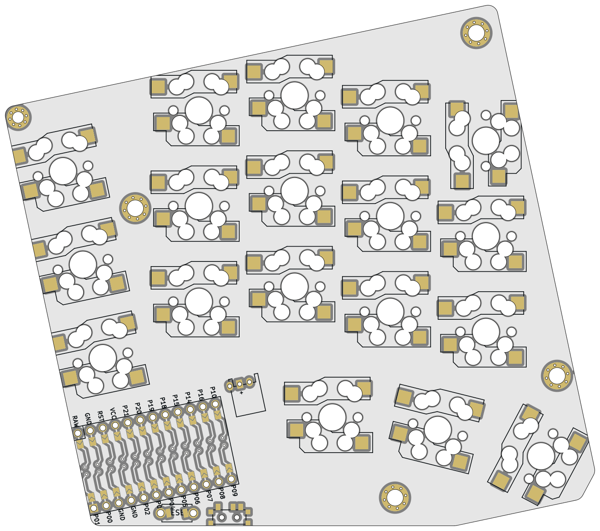
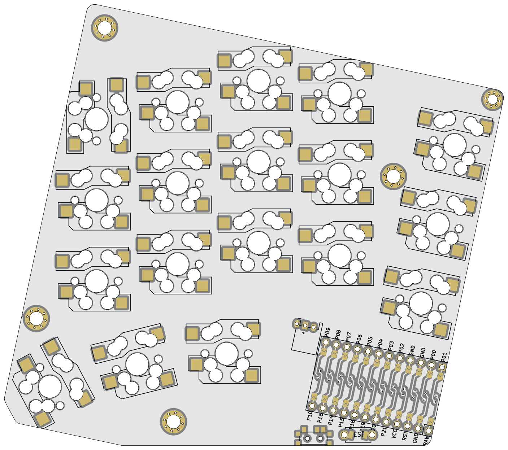
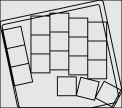

# Hecto36
## A sub 100x100mm split keyboard with pinky splay

left | right | outline
-|-|-
 |  | 

A 5x3 split keyboard with 3 thumb keys. 

## Previous version
[sweep_sq_rot](https://github.com/ezxzeng/sweep_squared_rot)
- this does not have the pinky splay

## Inspiration

- [bgkeeb](https://github.com/sadekbaroudi/bgkeeb)
	- keyboard pcbs under 100mm x 100mm are cheap
- [cheapis](https://github.com/dotleon/cheapis)
	- sweeps can be rotated for more room and length between the thumb cluster and rest of the keys and still fit within 100mm x 100mm
- [samoklava](https://github.com/soundmonster/samoklava) and [ergogen](https://ergogen.cache.works/) to get keyboard layouts programatically
- [sweep](https://github.com/davidphilipbarr/Sweep) and [swweeep](https://github.com/sadekbaroudi/sweep36) for form factor and diode-less design
- [Lily58](https://github.com/kata0510/Lily58/tree/master)
	- key sockets can be hot swappable, reversible, and compatible with both mx and low profile switches
- [totem](https://github.com/GEIGEIGEIST/totem)
	- sandwich case looks really slick and clean, and can also hide the controller parts that will be located under the palm

## Features

- 100mm x 100mm pcb for really cheap fabrication
- reversible footprint
- programatically generated with [ergogen](https://ergogen.cache.works/) (mostly)
- `footprints/key_switches.js` enables deciding between combinations of MX, Choc, or gateron low profile sockets

## Other considerations
- this design does not support LEDs or displays
- [samoklava's](https://github.com/soundmonster/samoklava) auto routing does not really work here


## Rendering and generation

### Generate config:
```bash
python generate_config.py
```
Alternatively, edit the units of base_units.yaml with files from the `unit_diffs` folder.

For example, to generate a case compatible with gateron low profile keyboards and a 1u thumb key instead of 1.5u:
```bash
python generate_config.py unit_diffs/bottom_usb.yaml unit_diffs/gateron_lp_case.yaml 
```


### Ergogen:
```bash
ergogen .
```

### Case:
tbd

### Get board image renderings:
```bash
docker run -v $(pwd):/kikit --entrypoint pcbdraw yaqwsx/kikit:v1.3.0-v7  plot --style style.json routed_pcb/board.kicad_pcb images/board-front.png

docker run -v $(pwd):/kikit --entrypoint pcbdraw yaqwsx/kikit:v1.3.0-v7  plot --style style.json --side back routed_pcb/board.kicad_pcb images/board-back.png
```

## Showcase


